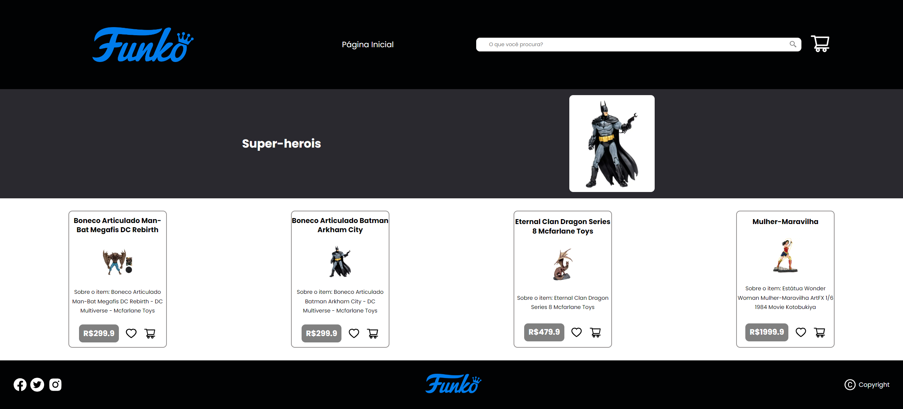
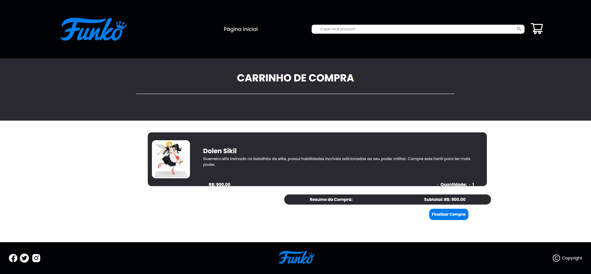

# Projeto Final Redux

### Time:
- Daniela Holem Leguari
- Luiza Dara Valentini

📌 Comandos para rodar o projeto após clonar o repositório em sua máquina:

### `npm install`
### `npm start`

## Dependências do projeto

### `npm install react-icons --save`
### `npm i react-router-dom`

## Página Home

## Página Categorias

## Página Carrinho de Compras

## Página de Erro

### Referências
-  Site utilizado como inspiração:
https://www.geekfanaticos.com.br/
