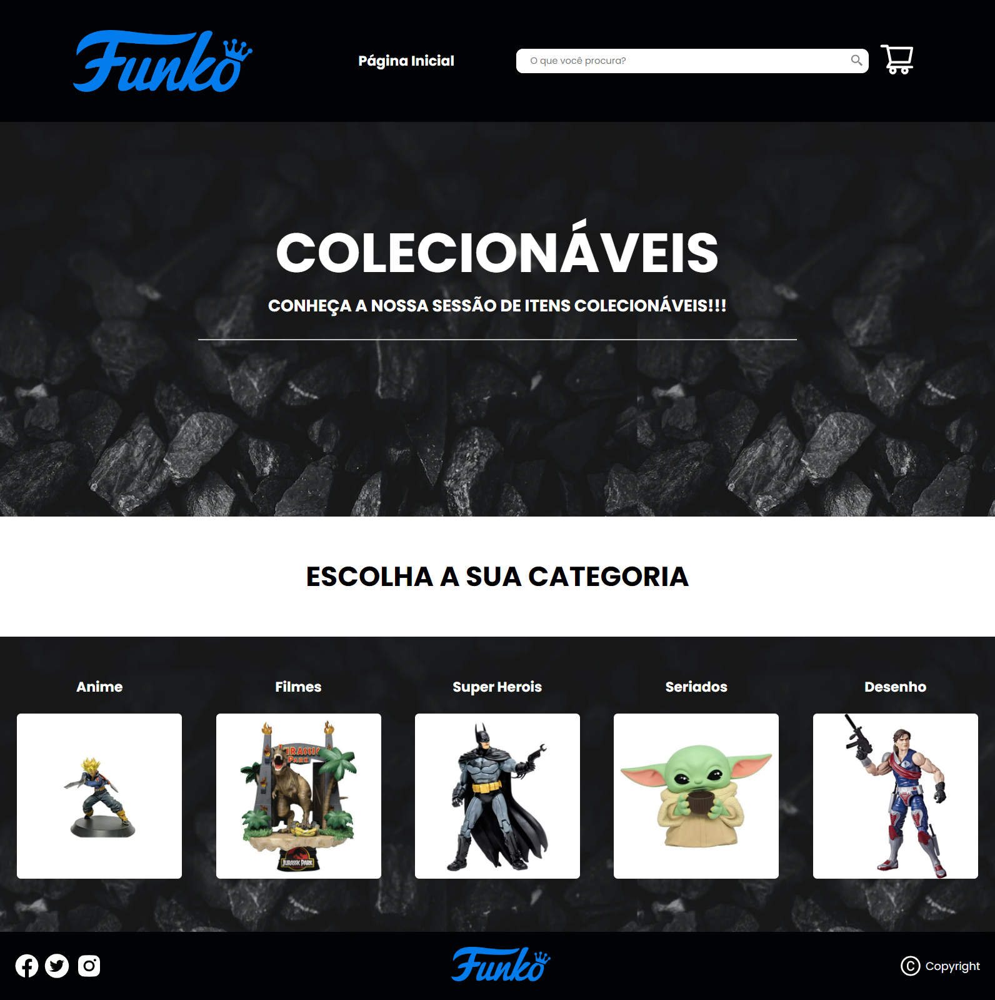
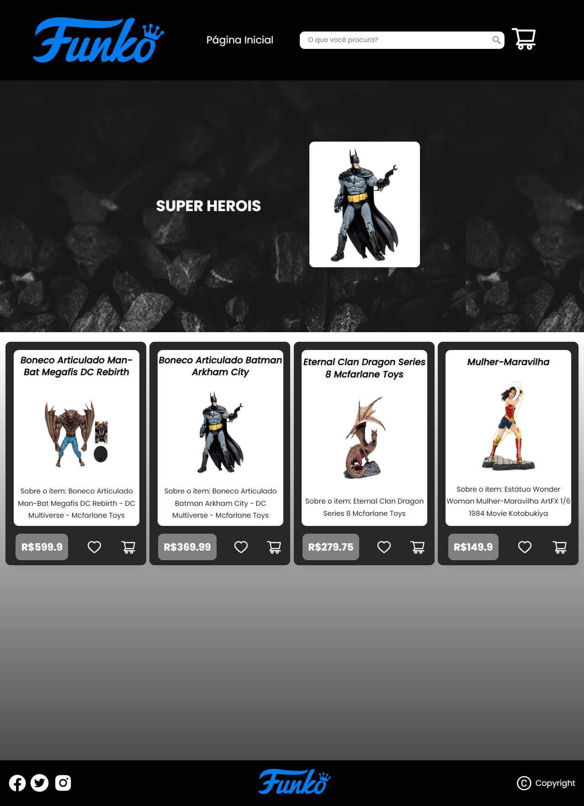
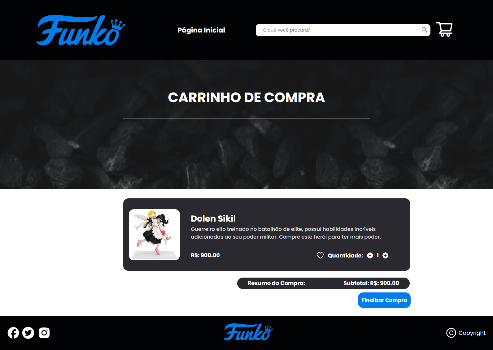

# Projeto Final Redux

  
 
  
  
  

    

### Time:
- Daniela Holem Leguari
- Luiza Dara Valentini

📌 Comandos para rodar o projeto após clonar o repositório em sua máquina:

### `npm install`

### `npm start`

## Dependências do projeto

### `npm install react-icons --save`

### `npm i react-router-dom`

### `npm i @reduxjs/toolkit react-redux`

### `npm i uuid`

### `npm install react-redux`

### Estrutura do Projeto

- Projeto é composto por:
- Página Home;
- Página Categorias;
- Página de Carrinho de compras;
- Página de Erro.

## Página Home

## Página Categorias

## Página Carrinho de Compras

## Página de Erro

### Referências
-  Site utilizado como inspiração:
https://www.geekfanaticos.com.br/
